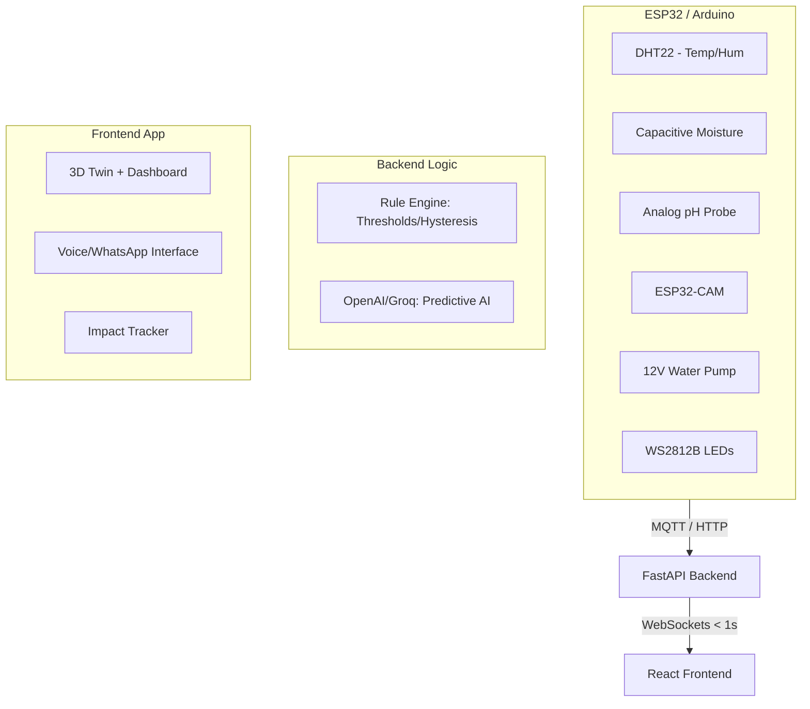

# AuraFarm 🌿
### Voice-First Vertical Farming for the Future of Urban Agriculture

[](https://github.com/JY156/UTMxHackathon_AuraFarm)
[](https://github.com/JY156/UTMxHackathon_AuraFarm)
[](LICENSE)

> "AuraFarm is a voice-first vertical farming platform designed to make urban agriculture accessible to everyone, not just experts."

---

## 🚀 The Vision
Urbanization is shrinking farmland, and climate change is disrupting supply chains. While vertical farming is the solution, **40% of urban farms fail** due to complexity, high costs, and lack of accessible automation.

**AuraFarm** bridges this gap with a browser-based, zero-install platform that combines high-fidelity 3D monitoring, AI-driven automation, and conversational control to ensure anyone—regardless of technical expertise—can grow food sustainably.

---

## ✨ Key Features

| Feature | Description |
| :--- | :--- |
| **3D Digital Twin** | Interactive 3D model of your farm that reflects live system status in real-time. |
| **Voice Commands** | "Turn on pump" or "Set lights to purple"—control your farm hands-free. |
| **WhatsApp Control** | Global remote access—send text or voice commands to your farm from anywhere and receive instant telemetry updates via WhatsApp. |
| **Red Dot Alerts** | Precision fault detection; interactive floating markers instantly pinpoint critical issues requiring human intervention—bridging the gap where automation meets manual oversight. |
| **AI Agronomist** | Smart recommendations (e.g., "Adjust pH to 6.2") with confidence scores and reasoning. |
| **Impact Tracker** | Real-time sustainability metrics; live monitoring of water conservation, electricity usage, and cost-efficiency. |
| **Crop Templates** | One-click optimal settings for Lettuce, Basil, or Tomato. |
| **Auto-Automation** | Rule-based engine triggers fans, pumps, and lights based on sensor data. |

---

## 🛠️ System Architecture

AuraFarm uses a **Hardware-Agnostic IoT Architecture** to prevent vendor lock-in and ensure low-latency responsiveness.



---

## 📊 Why AuraFarm?

| Feature | Industrial (Priva/Argus) | Consumer (Gardyn/Click & Grow) | AuraFarm |
| :--- | :--- | :--- | :--- |
| **Cost** | $5,000 – $20,000+ | $300 – $1,500 (Lock-in) | **RM 0 – 129 / month** |
| **Control** | Complex Desktop Software | App-only, limited automation | **Browser + WhatsApp + Voice** |
| **AI/Insights**| Raw Data Dashboards | Basic Growth Tracking | **Predictive Alerts + AI Agronomist** |
| **Hardware** | Proprietary Sensors | Locked Ecosystem | **Hardware-Agnostic (ESP32/Arduino)** |
| **Accessibility**| Requires Expert Training | Casual Hobbyist | **Elderly/Disabled Friendly** |

---

## 🌍 Market Opportunity & Impact
The vertical farming market is projected to reach **$15.8B by 2030 (24.8% CAGR)**. AuraFarm targets:
- **Urban Farmers** looking for affordable automation.
- **Schools & Universities** for educational greenhouses.
- **Restaurants** for farm-to-table freshness.

**The Impact:**
- 💧 **90% less water** compared to traditional farming.
- 🚫 **Zero pesticides**.
- 🥗 **365-day harvest cycles** regardless of weather.

---

## 💻 Tech Stack

- **Frontend:** React 19, Three.js, React Three Fiber, Zustand, Framer Motion, Tailwind CSS.
- **Backend:** FastAPI (Python), WebSockets, MQTT.
- **AI:** OpenAI / Groq (Natural Language Processing & Agronomist Reasoning).
- **Messaging:** Twilio (WhatsApp Integration).

---

## 🛠️ Setup & Installation

### Prerequisites
- Node.js (v18+)
- Python 3.10+
- (Optional) ESP32 with sensors for physical integration.

### Frontend Setup
```bash
cd frontend
npm install
npm run dev
```

### Backend Setup
```bash
cd backend
# Create virtual environment
python -m venv venv

# Activate virtual environment
# On Windows:
venv\Scripts\activate
# On Unix or macOS:
source venv/bin/activate

# Install dependencies
pip install -r requirements.txt

# Start the server
uvicorn main:app --reload
```

---

## 👥 Team Meow3Wang
Developed with ❤️ for **UTMxHackathon**.

- **Frontend Dashboard, Voice Command & WhatsApp:** [Teo Jing Ying](https://github.com/JY156) (@JY156)
- **Frontend 3D Digital Twin & UIUX:** [Nicol Heng Si Yi](https://github.com/nicolheng) (@nicolheng)
- **Backend, System Architecture & Lead Presenter:** [Tan Syn Yee](https://github.com/synyee) (@synyee)

---
© 2026 Team Meow3Wang. All rights reserved.